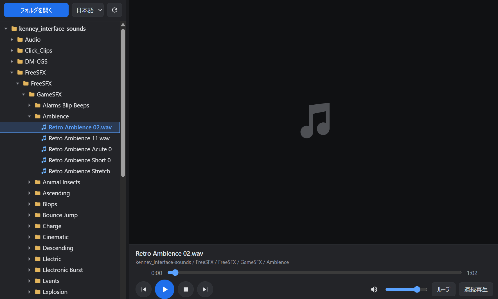

# Easy SE Check

[日本語](#日本語) · [English](#english)

## 日本語

ローカルの効果音・音声・動画を、フォルダをたどりながら試聴するシンプルなツールです。上下キーで再生するファイルを簡単に切り替えられるので、複数の効果音を続けて聞き比べられます。HTMLファイル1つで動作し、インストールやビルドは不要です。

### 使い方

1. このリポジトリをダウンロードするか、`git clone https://github.com/icematerial/Easy-SE-Check.git` で取得します。
2. デスクトップ版のChromeまたはEdgeで `index.html` を開きます。Windowsでは `run.bat` をダブルクリックするだけで、独立したアプリ風のウィンドウで簡単に起動できます。Macでは `.bat` は実行できないため、`index.html` をChromeまたはEdgeで開いてください（Macでの実動作は未確認です）。
3. 「フォルダを開く」で音声・動画のあるフォルダを選び、読み取りを許可します。フォルダのドラッグ＆ドロップでも追加できます。
4. 一覧のファイルを選ぶと再生します。画面上部の言語選択で日本語／Englishを切り替えられます。

### 機能と操作

- 複数フォルダの追加、サブフォルダの展開、一覧の再読み込み
- 再生・一時停止・停止、前後のファイルへの移動、シーク、音量・ミュート
- 1ファイルのループ、同じフォルダ内の連続再生（ループ中は現在のファイルを繰り返します）
- 動画の表示、動画のダブルクリックによる全画面表示
- 言語・音量・再生オプション・左右の幅を保存し、追加したフォルダを次回起動時に復元（再許可が必要な場合があります）

| キー | 操作 |
| --- | --- |
| Space | 再生／一時停止 |
| ↑ / ↓ | 一覧を移動。音声・動画ファイルは選択すると再生 |
| ← / → | 5秒戻す／進める |
| Enter | 選択したフォルダを開閉、またはファイルを再生 |
| Delete | 選択した最上位フォルダを一覧から外す |

入力欄やボタンにフォーカスがある場合、上記ショートカットは適用されません。一覧から外しても、元のファイルやフォルダは削除されません。

### 対応形式と保存

音声: `mp3`, `wav`, `ogg`, `oga`, `opus`, `m4a`, `aac`, `flac`, `weba`。動画: `mp4`, `m4v`, `mov`, `webm`, `mkv`, `ogv`。一覧に表示される形式でも、実際に再生できるかはブラウザのコーデック対応に依存します。

選択したファイルはブラウザ内で読み取り、サーバーへのアップロードは行いません。設定とフォルダへの参照はブラウザ内に保存します。Windowsの起動用バッチは `%LocalAppData%\SECheck\profile` に専用ブラウザプロファイルを作成します。画面の操作表示は日本語・英語に対応していますが、ファイル名やブラウザ自身のダイアログは翻訳しません。

### 開発・ライセンス

アプリのHTML・CSS・JavaScriptは `index.html` にまとまっています。外部ライブラリやビルド処理はありません。変更後はChrome／Edgeで開き、フォルダ選択・再生・言語切り替えを確認してください。

MIT License。詳細は [LICENSE](LICENSE) を参照してください。

## English

A simple tool for previewing local sound effects, audio, and video while browsing folders. Easily switch between files with the Up and Down arrow keys to compare sound effects in quick succession. It runs from a single HTML file with no installation or build step.

### Getting started

1. Download this repository or run `git clone https://github.com/icematerial/Easy-SE-Check.git`.
2. Open `index.html` in desktop Chrome or Edge. On Windows, simply double-click `run.bat` to launch a separate app-style window. On Mac, `.bat` files cannot run natively; open `index.html` in Chrome or Edge instead (not yet tested on Mac).
3. Click **Open folder**, select a folder containing audio or video, and allow read access. You can also drag and drop folders into the window.
4. Select a file to play it. Use the language selector at the top to switch between Japanese and English.

### Features and controls

- Add multiple folders, expand subfolders, and refresh the file list.
- Play, pause, stop, move between files, seek, adjust volume, and mute.
- Loop one file or automatically play the next file in the same folder. When looping is enabled, the current file repeats.
- Preview videos; double-click a video to toggle fullscreen.
- Save language, volume, playback options, and sidebar width. Restore added folders on the next launch; permission may need to be granted again.

| Key | Action |
| --- | --- |
| Space | Play / pause |
| ↑ / ↓ | Move through the list; selecting an audio or video file starts playback |
| ← / → | Seek backward / forward by 5 seconds |
| Enter | Expand / collapse the selected folder, or play the selected file |
| Delete | Remove the selected top-level folder from the list |

These shortcuts do not apply while an input or button has focus. Removing a folder from the list does not delete files or folders from disk.

### Formats and local storage

Audio: `mp3`, `wav`, `ogg`, `oga`, `opus`, `m4a`, `aac`, `flac`, `weba`. Video: `mp4`, `m4v`, `mov`, `webm`, `mkv`, `ogv`. A listed extension does not guarantee playback: codec support depends on the browser.

Selected files are read locally in the browser and are not uploaded to a server. Settings and folder references are stored in the browser. The Windows launcher creates a dedicated browser profile at `%LocalAppData%\SECheck\profile`. App controls support Japanese and English; file names and browser dialogs retain their original language.

### Development and license

The app's HTML, CSS, and JavaScript live in `index.html`. There are no external libraries or build steps. After editing, open it in Chrome / Edge and check folder selection, playback, and language switching.

Released under the MIT License. See [LICENSE](LICENSE).
